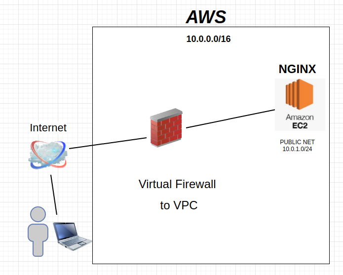

# Documentação AWS com Terraform
url de teste: http://ec2-54-149-42-74.us-west-2.compute.amazonaws.com/
```
01- TOPOLOGIA
```


```
01) Virtual private cloud (VPC) — Rede virtual dedicada AWS

02) Subnet — A range de IP addresses no seu VPC.

03) Route table — Regras de rotas usadas para direcionar o tráfego de rede.

04) Internet gateway — Um gateway atribuido a sua VPC para habilitar a comunicação com os recursos da VPC e internet.

05) Rota para Internet

06) Associando rota para internet
```
```
01)Criando VPC

Criando VPC
1) Neste bloco de código estamos criando nossa VPC. Na primeira linha é onde se define o tipo de recurso a ser criado, no nosso caso “aws_vpc” e depois informamos o nome, depois passamos os dados dessa VPC que são: bloco CIDR, instance tenancy e habilitamos suporte DNS e DNS Hostname suporte. Por fim é possível adicionar tag ao recurso. Conforme código abaixo:

resource "aws_vpc" "VPC_teste" {
  cidr_block           = var.vpcCIDRblock
  instance_tenancy     = var.instanceTenancy 
  enable_dns_support   = var.dnsSupport 
  enable_dns_hostnames = var.dnsHostNames
    tags = {
        Name = "VPC teste"
    }
}
```
```
02)Criando Subnet

Neste bloco de código estamos criando uma subnet. Na primeira linha informamos o recurso a ser criado “aws_subnet” e o nome, depois passamos as informações da subnet, como: VPC que ela fará parte através do vpc_id, bloco CIDR, map_public_ip_on_launch que é onde habilitamos a atribuição de IP público e a availability zone que ela ficará alocada. Conforme código abaixo:

resource "aws_subnet" "Public_subnet" {
  vpc_id                  = aws_vpc.VPC_teste.id
  cidr_block              = var.publicsCIDRblock
  map_public_ip_on_launch = var.mapPublicIP 
  availability_zone       = var.availabilityZone
    tags = {
    Name = "Public subnet"
    }
}
```
```
03)Route Table

Neste bloco de código é onde criamos uma route table. Para isso definimos o recurso “aws_route_table” e informamos o nome, depois informamos a VPC que ela fará parte através do vpc_id e podemos adicionar uma tag. Conforme código abaixo:

resource "aws_route_table" "Public_RT" {
 vpc_id = aws_vpc.VPC_teste.id
    tags = {
            Name = "Public Route table"
    }
}

```
```
04)Internet Gateway

Neste bloco de código é onde criamos o gateway de internet. Para isso devemos informar o recurso “aws_internet_gateway”, nome, depois a VPC que fará parte e por fim é possível adicionar uma tag. Conforme código abaixo:

resource "aws_internet_gateway" "IGW_teste" {
 vpc_id = aws_vpc.VPC_teste.id
    tags = {
            Name = "Internet gateway teste"
    }
}

```
```
05)Rota para internet

Neste bloco de código é onde configuramos a rota da route table para a internet, apontando para um gateway de internet. Para isso devemos informar o recurso a ser criado, nesse caso é “aws_route” e informamos também o nome, em seguida devemos informar a route table que terá a rota criada com o route_table_id, o IP ou bloco CIDR e por fim o destino dessa rota. Conforme código abaixo:

resource "aws_route" "internet_access" {
  route_table_id         = aws_route_table.Public_RT.id
  destination_cidr_block = var.publicdestCIDRblock
  gateway_id             = aws_internet_gateway.IGW_teste.id
}


```
```
06)Associando route table a subnet

1) Neste bloco de código é onde associamos a route table a uma subnet para atribuir as rotas de acesso. Para isso devemos informar o recurso “aws_route_table_association”, depois o nome. Em seguida informamos a subnet com o subnet_id e a route table com o route_table_id.

resource "aws_route_table_association" "Public_association" {
  subnet_id      = aws_subnet.Public_subnet.id
  route_table_id = aws_route_table.Public_RT.id
}
```
```
Links:
https://docs.aws.amazon.com/vpc/index.html
https://docs.aws.amazon.com/vpc/latest/userguide/vpc-subnets-commands-example.html#vpc-subnets-commands-example-create-vpc
https://www.jlcp.com.br/criando-rede-vpc-na-aws-com-terraform/
```
